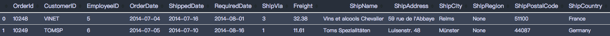

**目录**

[TOC]

**说明**

创建一些工具用于解决在项目中需要使用到的一些问题

# 1. [SQL 格式](./SQLFormat.py)

该工具是为了格式化输出 SQL 格式。输出的格式例子：



## 1.1 Requirements

* chardet
* pandas
* sqlite3

## 1.2 使用举例

```python
# load 
from SQLFormat import SQLFormat
# create the connection
conn = sqlite3.connect("test.squlite3")

# create the formater object
formater = SQLFormat(conn)

# display the query
formater.format("SELECT * FROM Orders LIMIT 2")
```


